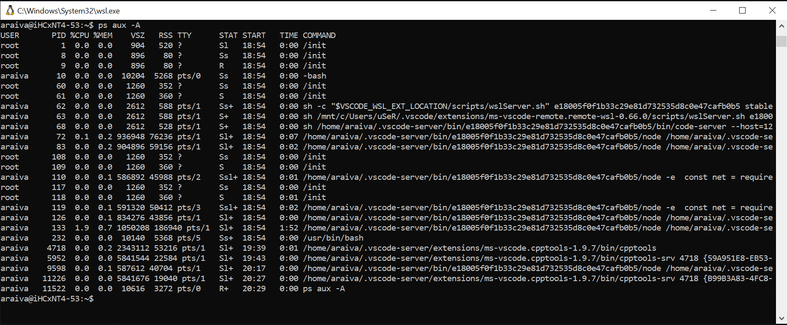
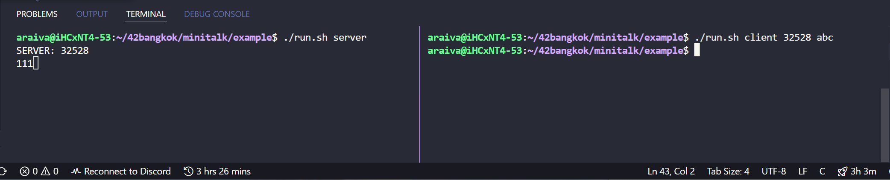

# Minitalk in Nutshell

## 42Bangkok Curcus minitalk project

Explain linux signal process in c in short and easy
>
> Thai version
> 

## Learning Resources
thank you to [`nnakarac`] [`tratanat`] and [`spoolpra`].

- [GNU Library](https://www.gnu.org/software/libc/manual/html_node/Signal-Handling.html)
- [Unix Process](https://www.youtube.com/playlist?list=PLfqABt5AS4FkW5mOn2Tn9ZZLLDwA3kZUY)
- [C Signal handlers](https://linuxhint.com/signal_handlers_c_programming_language/)
- [UTF-8](https://en.wikipedia.org/wiki/UTF-8)

## Computer Process

Computer process คือ กิจกรรมที่กำลังทำงานอยู่บนเครื่องคอมพิวเตอร์ ซึ่งเราสามารถดูได้ผ่าน [Task Manager] กรณีใช้งานบน Window หากบน Linux สามารถดูได้โดยใช้คำสั่ง [`ps`]

**ตัวอย่าง**
```sh
ps aux
```

<div align=center>
 
</div>

ซึ่งเหมือนกันกับตัวโปรแกรม ภาษา C ที่เราใช้งานก็ต้องทำงานบน Computer Process แต่เมื่อตัวโปรแกรมจบการทำงาน ตัว Process ก็จะหยุดทำงานโดยอัตโนมัติ

## Get your own process

การหา process id ของโปรแกรม ทำได้ง่ายๆ เพียงใช้ฟังชั่น [`pid`]

```c++
#include <stdio.h>
#include <sys/types.h>
#include <unistd.h>

int	main(void)
{
	pid_t process_id;
	pid_t p_process_id;

	process_id = getpid();
	p_process_id = getppid();
	printf("The process id: %d\n",process_id);
	printf("The process id of parent function: %d\n",p_process_id);
	return (0);
}
```
_Reference: [Process Identification]_

## Signal Communicate

การพูดคุยกันระหว่างโปรแกรม โดยอาศัยการส่งสัญญาณ (signal) ผ่าน process

#### ตัวโปรแกรม จะแบ่งออกเป็น 2 ส่วน

1. ตัวรอรับสัญญาณ
2. ตัวส่งสัญญาณ

#### รูปแบบการพูดคุยแบ่งออกเป็น 3 รูปแบบ

- [Parent to Child]
  ระบบคุยกันภายในระหว่างการทำงานหลัก กับ การทำงานย่อย
- [Group to Member]
  ระบบคุยกันภายในกลุ่มการทำงาน
- Client to Server
  ระบบคุยกันระหว่างโปรแกรม

#### ประเภทสัญญาณ (Signal Types)

ประเภทสัญญาณที่สื่อสารกันระหว่าง Process มีด้วยกันหลายแบบ

| Signal  | Value | Description |
| ------- |--:| -----|
| SIGHUP  | 1 | Report that user's terminal is disconnected. |
| SIGINT  | 2 | Interrupt (ANSI) Program interrupt. (ctrl-c) |
| SIGQUIT | 3 | Terminate process and generate core dump. |
| SIGTRAP | 5 | Trace trap (POSIX). |
| SIGABRT | 6 | Abort (ANSI) |
| SIGKILL | 9 | Kill, unblockable (POSIX) |
| SIGUSR1 | 10 | *User-defined signal 1 |
| SIGSEGV | 11 | Segmentation Violation (ANSI) |
| SIGUSR2 | 12 | *User-defined signal 2 |
| SIGTERM | 15 | Termination (ANSI) |
| SIGCONT | 18 | Continue (POSIX) |

_Referrence: [C Signal Types]_

## How to create Signal

การเขียน Signal ประกอบด้วย 2 ส่วนหลัก คือ ตัวรับสัญญาณที่ เชื่อม ระหว่าง ประเภทสัญญาณ (Signal Types) กับ ฟังชั่นสำหรับจัดการ (handler) ซึ่งสามารถเขียนตัวรับสัญญาณได้ 2 คำสั่ง

1. [`signal`] แบบพื้นฐาน

```c++
#include <stdio.h>
#include <unistd.h>
#include <stdlib.h>
#include <signal.h>

void sighandler(int);

int	main (void) {
	signal(SIGINT, sighandler);

	while(1) {
		printf("Going to sleep for a second...\n");
		sleep(1); 
	}
	return(0);
}

void sighandler(int signum) {
	printf("Caught signal %d, coming out...\n", signum);
	exit(1);
}
```

2. [`sigaction`] แบบแนะนำ

```c++
#include <unistd.h>
#include <signal.h>
# include <sys/types.h>

void handler (int signum, siginfo_t *info, void *ucontext);

int	main (void)
{
	struct sigaction action;

	action.sa_handler = handler;
	sigemptyset (&action.sa_mask);
	action.sa_flags = SA_SIGINFO;

	sigaction (SIGTERM, NULL, &old_action);
	while (1)
		pause();
	return (0);
}

void handler (int signum, siginfo_t *info, void *ucontext)
{
	(void) info;
	(void) ucontext;
	write(1, "Hello", 5);
}
```

จะสังเกตได้ว่า ทั้ง 2 รูปแบบจะมีการใช้ `while(true)` กับ `sleep()` หรือ `pause()` ซึ่งมีจุดประสงค์ดังนี้

- `while` เพื่อไม่ให้โปรแกรมหยุดทำงานสำหรับรอรับสัญญาณ
- `sleep` เพื่อหน่วงเวลา สำหรับรอการประมวลผลของแต่ละ process ซึ่งเร็วช้าขึ้นอยู่กับโปรแกรม ถ้าหากโปรแกรมเร็ว ก็สามารถลดการหน่วงเวลาได้
- [`pause`] หยุดรอรับสัญญาณ

#### [signal vs sigaction]
`sigaction` กับ `signal` ไม่ควรใช้งานร่วมกันในโปรแกรมเดียวกัน ซึ่งตัว `sigaction` มีการจัดการและการเก็บข้อมูลที่ดีกว่า `signal` แบบธรรมดามาก ดังนั้นหากเพื่อหลีกเลี่ยงปัญหาต่างๆ จึงแนะนำให้ใช้ `sigaction` มากกว่า

> **แนะนำ `sigaction` **

## Signaling Another Process

การส่งข้อมูลระหว่างโปรแกรมผ่าน process นั้นสามารถทำได้ด้วยคำสั่ง `kill` ไปยัง process ที่เราต้องการพร้อมแนบรูปแบบสัญญาณไปด้วย กรณีผิดผลาดจะคืนผลลัพธ์เป็น `-1`

- [`kill()`]: 	

```c++
#include <unistd.h>
#include <signal.h>
#include <sys/types.h>

int	main ()
{
	// int kill (pid_t pid, int signum)
	if (kill(1234, SIGUSR2) == -1);
		exit(1);
	else
		write(1, "SUCCEED", 6);
}
```

_กรณีอยากใช้สัญญาณเฉพาะของตนเอง ต้องใช้ประเภท `SIGUSR1` และ `SIGUSR2` ซึ่งมีแค่ 2 ประเภทเท่านั้น_

---

## Example

### Usage

Start server

```sh
$ sh ./run.sh server
SERVER: 1234
```

Run Client in other terminal tab input `pid` and `text` the output will show in server terminal

```sh
# sh ./run.sh client <pid> <text>
sh run.sh client 1234 ABC
```

**Result**

<div align=center>
 
</div>

## AT LAST

~~ เท่านี้เราก็สามารถพูดคุยกันระหว่างโปรแกรมได้แล้ว **MINITALK!!!** ~~

---


[Task Manager]: https://www.howtogeek.com/405806/windows-task-manager-the-complete-guide/
[`ps`]: https://www.cyberciti.biz/faq/show-all-running-processes-in-linux/
[`pid`]: https://ftp.gnu.org/old-gnu/Manuals/glibc-2.2.3/html_node/libc_554.html
[Process Identification]: https://www.includehelp.com/c/process-identification-pid_t-data-type.aspx
[Parent to Child]: https://www.geeksforgeeks.org/signals-c-language/?ref=lbp
[Group to Member]: https://sites.cs.ucsb.edu/~almeroth/classes/W99.276/assignment1/signals.html#Pgrps
[C Signal Types]: http://www.yolinux.com/TUTORIALS/C++Signals.html
[`signal`]: https://www.gnu.org/software/libc/manual/html_node/Basic-Signal-Handling.html
[`sigaction`]: https://man7.org/linux/man-pages/man2/sigaction.2.html
[`pause`]: https://www.gnu.org/software/libc/manual/html_node/Using-Pause.html
[signal vs sigaction]: https://www.gnu.org/software/libc/manual/html_node/Signal-and-Sigaction.html
[`kill()`]: https://www.gnu.org/software/libc/manual/html_node/Signaling-Another-Process.html
[`nnakarac`]: https://profile.intra.42.fr/users/nnakarac/
[`tratanat`]: https://profile.intra.42.fr/users/tratanat/
[`spoolpra`]: https://profile.intra.42.fr/users/spoolpra/